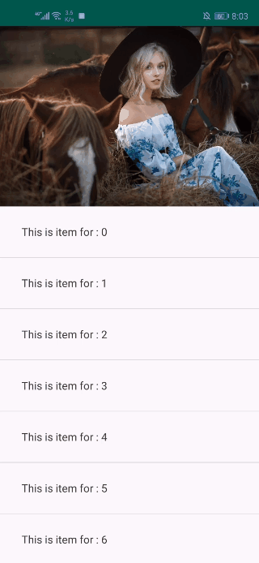
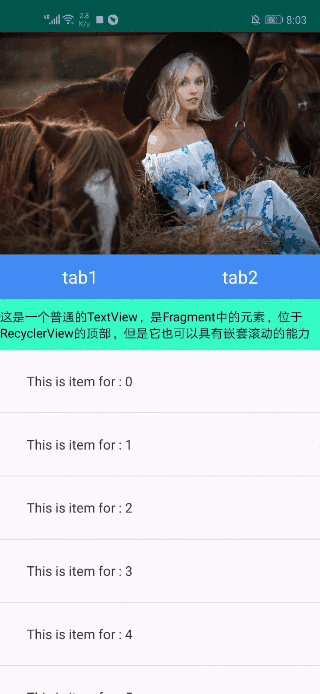
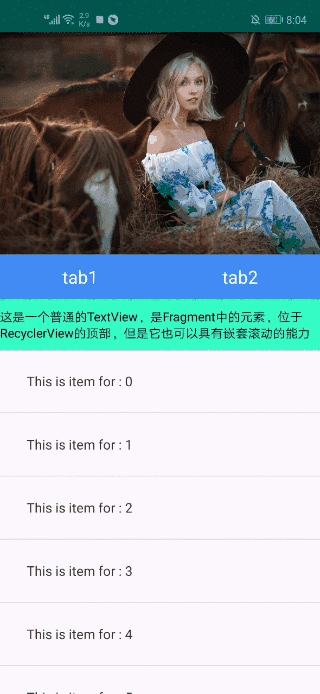
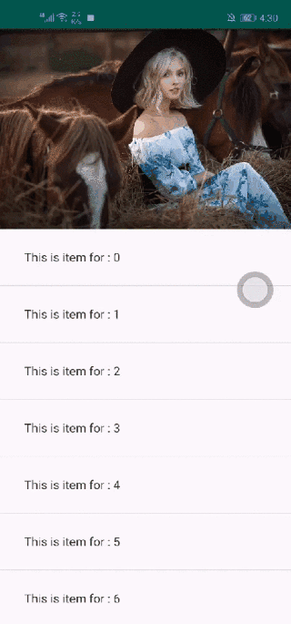

# NestedScrollLayout
🔥或者叫做 StickyTabLayout ， 可以配合 RecyclerView、ViewPager、NestedScrollView、以及普通控件完成顶部吸附效果，整个布局均实现了触摸时跟随手指scroll 和 fling, 并处理了水平方向和垂直方向的滑动冲突。

效果图如下：

&nbsp;&nbsp;&nbsp;&nbsp;&nbsp;&nbsp;&nbsp;&nbsp;&nbsp;&nbsp;&nbsp;&nbsp;&nbsp;&nbsp;&nbsp;&nbsp;&nbsp;&nbsp;&nbsp;&nbsp;

## 1. install
implementation 'com.mrh.nestedscroll:nested_scroller:0.0.1'
## 2. 主要控件说明
### NestedScrollLayout
继承自LinearLayout，默认方向为垂直方向。可作为应用中的最外层布局，内部只能且必须按顺序包含两个子View：NestedHeaderView、NestedBodyView.

```
<?xml version="1.0" encoding="utf-8"?>
<com.mrh.nested_scroller.NestedScrollLayout xmlns:android="http://schemas.android.com/apk/res/android"
    xmlns:tools="http://schemas.android.com/tools"
    android:layout_width="match_parent"
    android:layout_height="match_parent"
    tools:context=".rv.RecyclerViewActivity">

    <com.mrh.nested_scroller.child.NestedHeaderView
        android:layout_width="match_parent"
        android:layout_height="wrap_content"
        android:orientation="vertical">
        
        <!-- 自定义你的头部View -->
        
    </com.mrh.nested_scroller.child.NestedHeaderView>

    <com.mrh.nested_scroller.child.NestedBodyView
        android:layout_width="match_parent"
        android:layout_height="match_parent">

        <!-- 自定义你的内容View -->
        
    </com.mrh.nested_scroller.child.NestedBodyView>
    
</com.mrh.nested_scroller.NestedScrollLayout>
```

### NestedHeaderView
默认的头部布局，继承自LinearLayout，并实现了NestedHeader接口。如果想要自定义头布局，只需要在自定义的类上实现NestedHeader接口，并参考NestedHeaderView的源码实现滑动的处理机制即可。
### NestedBodyView
默认的内容布局，继承自LinearLayout。如果想要自定义内容布局，只需要在自定义的类上实现NestedBody接口即可。
### NestedScrollDispatcherLayout
继承自LinearLayout。在安卓的控件中像RecyclerView、NestedScrollView等控件在onTouchEvent方法中都是具有处理NestedScroll（嵌套滚动）的功能的，但是其他的普通控件例如 TextView、ImageView是不具有嵌套滚动的功能的。NestedScrollDispatcherLayout则是一个嵌套滚动的帮助类，在TextView、ImageView等控件的外层包一层NestedScrollDispatcherLayout，则可以具有嵌套滚动的功能。
### NestedHeader 和 NestedBody 接口
这两个接口只是标识作用，并没有实际的方法，用于在NestedScrollLayout中重新设置header和body的尺寸。
